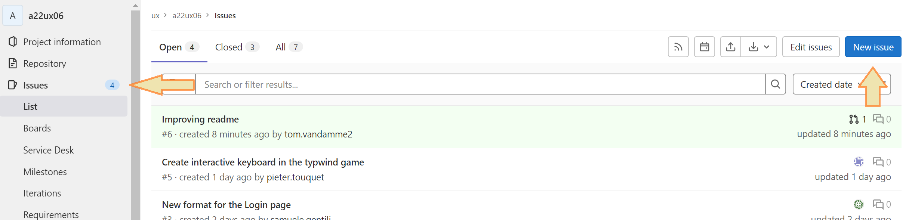
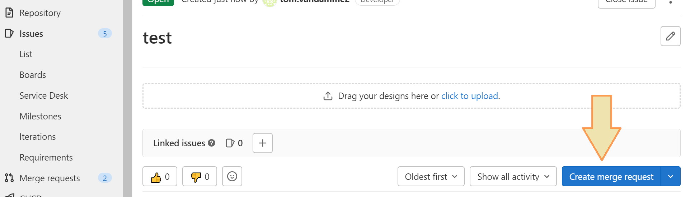

# MP22-Team-c5-FA
## Table of Contents
* [CI/CD/VC Guidelines in development (Git)](#cicdvc-guidelines-in-development)
&nbsp;

## CI/CD/VC Guidelines in development
_Taken from Tom's self-written readme for UXWD_

How do you properly develop new features or fix stuff without fracking it up for the rest of the team?
* The code snippets below assume you use a terminal for git, this can either be your machine terminal but your IDE should have one as well
### Decide on what you want to develop
Think of them as user stories (I guess?), CI/CD implies that the stuff you develop are small increments to existing code, each increment having a meaningful goal that demo-able while being as small as possible (less intrusive in codebase)
### Create an issue on Gitlab

Creating an issue is fairly straightforward. You press the big blue button in the issues screen, after which you are redirected to the form to create the issue. The only information we require is a descriptive title and an indication whether it is an **issue** (a new feature, larger bugfix) or an **incident** (hotfix or production issue). A description is optional, but can add information on top of the title.

### Creating a branch and merge request
When the issue has been created you are automatically redirected to the overview of the issue. In there you can create a merge request using the self-explaining button. This, however, will also create a branch the merge request will point to. No additional details are required in the merge request, it will be created as a **draft** (since it isn't ready to actually merge yet)

After creating the actual merge request, the branch will be noted on top. The title starts with a number (the same as the issue number) which is then followed by the issue title.

### Developing 
Now you are actually ready to start your work, yay! You do this by pulling from the origin on your local machine (doesn't matter which branch you're currently on).

    >>> C:\uxwd\a22ux06 [master ≡]> git pull
    Enter passphrase for key '/c/Users/vanda/.ssh/id_rsa': ***
    From gitlab.groept.be:ux/a22ux06
    * [new branch]      7-sidebar-hotfix -> origin/7-sidebar-hotfix
    Already up to date.

After this you can check out the newly created branch.

**Pro-tip**: Just type the issue number and then autocomplete using _tab_

    >>>  C:\uxwd\a22ux06 [master ≡]> git checkout 7-sidebar-hotfix

After development, you can commit and push as normal. When you are done developing you can mark the merge request as ready, this will remove the _draft_ tag which will give a visual indication to other members of the team that the code can be reviewed before merging if needed.

### Ooh, chips! I accidentally started developing without checking out the right branch

Don't panic, we can then temporarily save all our changes, checkout the correct branch, and then reapply our changes.
This is called stashing and happens as follows:

* Use `git status` to make sure the correct changes will get stashed
* Perform `git stash` to stash all your changes on a heap and return to the HEAD of the current branch
* Now you can safely `git checkout` another branch
* Apply these changes again using `git stash apply`
* Merge conflicts may occur if the branches diverge on the files you've been editing, but they will appear as usual in a way that you can solve them in your preferred IDE

### (Optional) Rebasing your development branch

_The master branch is used throughout this part as an example to rebase to, but in theory this can be any other branch_

If you want to bring your development branch up to speed with the current master branch you can do so. This may be desired for the following reasons:
* You want more power over merging, rebasing also brings up all the merge conflicts. With it, you can handle them in your favourite IDE
* Your development branch has diverged too much from the master branch and changes on the master require you to adapt your code
* You require new features already on the master branch in your development branch

To rebase, you checkout your development branch and run

    >>> C:\uxwd\a22ux06 [x-development ≡]> git rebase master x-development

The terminal will return information on where the merge conflicts occur.

### Merging into the master
This is where the magic of the merge requests and Gitlab come in. After development, you should go back to the merge request page. If no conflicts occur with the master (changes that have happened to the master branch in the meanwhile), you can click the big blue **Merge** button and call it a day. If there áre conflicts, Gitlab will show them automatically resulting in a nice and clean interface where you can handpick or edit the code according to the version you want (either from master or from the merging branch).
When all conflicts are resolved, merging will be available and can happen flawlessly.
